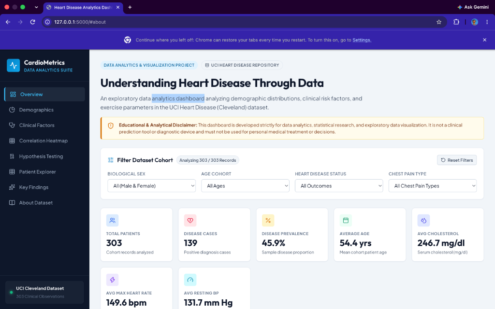
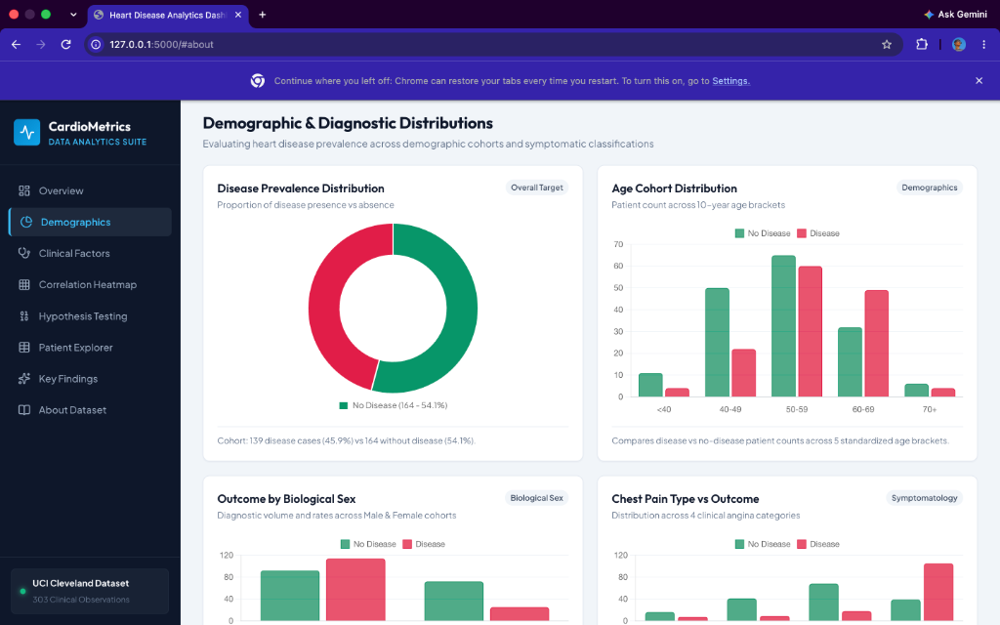
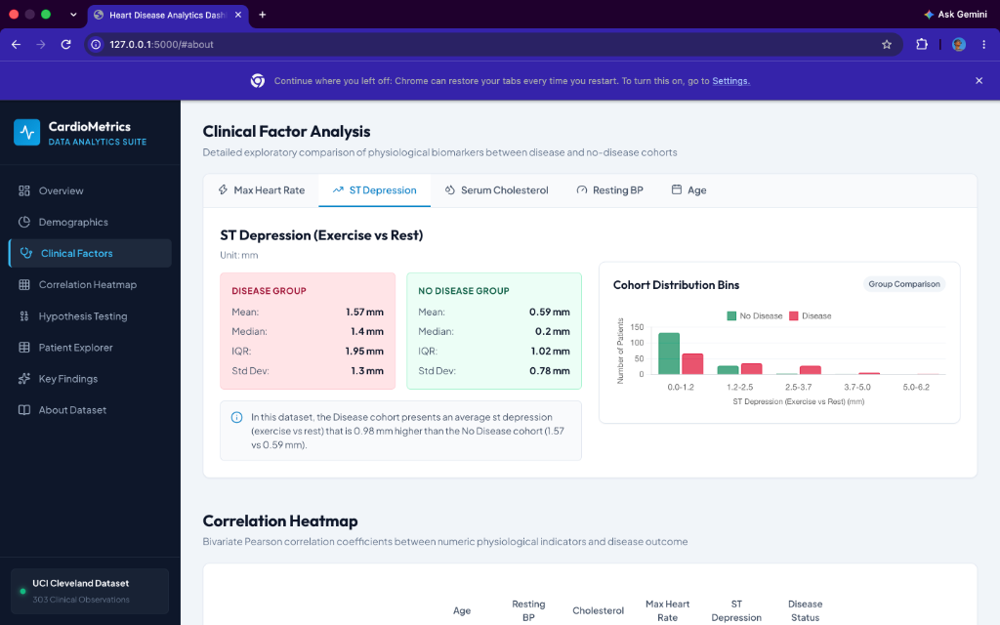
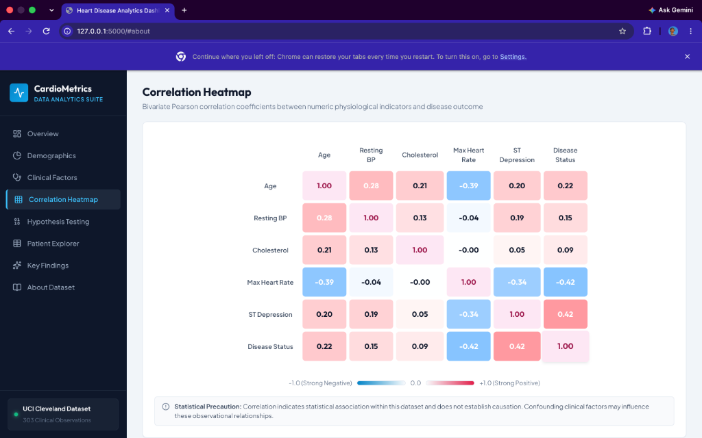
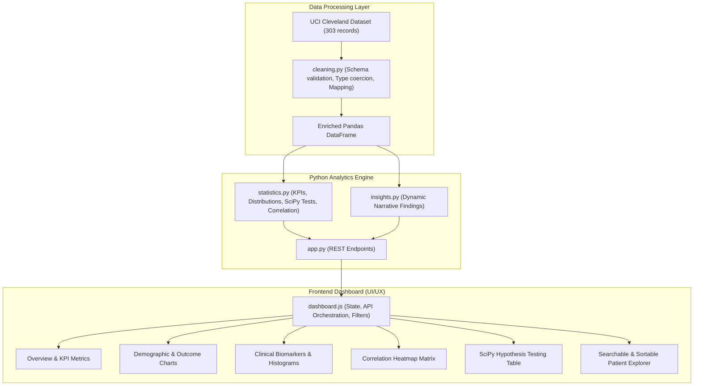

# ❤️ Heart Disease Analytics

### Interactive Data Analytics & Visualization Dashboard

> **Heart Disease Analytics (CardioMetrics)** is a full-stack exploratory data analytics platform built to transform the canonical UCI Heart Disease dataset into an interactive, visual analytics experience. The application pairs a Python analytics backend (Pandas, NumPy, SciPy) and Flask REST APIs with a modern, responsive JavaScript frontend and Chart.js dashboards, enabling researchers, analysts, and recruiters to explore demographic patterns, clinical biomarkers, correlation structures, and inferential hypothesis tests across clinical cohorts.

<p align="left">
  
  
  
  
  
  
  
  
</p>

---

## Project Preview

<div align="center">


*Figure 1: CardioMetrics Overview — Real-time KPI cards, educational disclaimer, and global multi-dimensional cohort filter panel.*

</div>

<br>

<div align="center">
<table>
  <tr>
    <td width="33.3%">
      
      <br>
      <div align="center"><strong>Demographic Distributions</strong><br><sub>Prevalence doughnut, 10-year age cohorts, sex comparison, &amp; chest pain types.</sub></div>
    </td>
    <td width="33.3%">
      
      <br>
      <div align="center"><strong>Clinical Factor Analysis</strong><br><sub>Group descriptive stats (Mean, Median, IQR, Std) &amp; cohort histograms.</sub></div>
    </td>
    <td width="33.3%">
      
      <br>
      <div align="center"><strong>Correlation Heatmap</strong><br><sub>Diverging Pearson r matrix with tooltips and non-causal notes.</sub></div>
    </td>
  </tr>
</table>
</div>

---

## At-a-Glance

| Dimension | Details |
| :--- | :--- |
| **Project Type** | Full-Stack Data Analytics &amp; Statistical Visualization Web Application |
| **Domain** | Healthcare Informatics &amp; Epidemiological Exploratory Analysis |
| **Dataset** | UCI Machine Learning Repository — Heart Disease (Cleveland Database) |
| **Cohort Size** | 303 Patient Records (14 Canonical Demographic and Clinical Attributes) |
| **Backend Engine** | Python 3.14 + Flask REST API |
| **Analytics Engine** | Pandas 3.0.2 + NumPy 2.4.4 + SciPy 1.17.1 |
| **Frontend Stack** | Semantic HTML5 + Custom Vanilla CSS3 Design System + Vanilla ES6+ JavaScript |
| **Visualizations** | Chart.js 4.4.1 (Doughnuts, Histograms, Grouped Bars) + Custom Correlation Heatmap |
| **Inferential Tests** | Mann-Whitney U, Welch's Two-Sample t-Test, Pearson's $\chi^2$ Test of Independence |
| **Execution** | Local Flask Server (`http://127.0.0.1:5000`) |

---

## Quick Start

```text
git clone → install dependencies → python3 app.py → open http://127.0.0.1:5000
```

```bash
# 1. Clone & enter project
git clone <repository-url>
cd "Heart Disease Risk Factor Analysis"

# 2. Install dependencies
python3 -m pip install -r requirements.txt

# 3. Launch analytics web server
python3 app.py

# 4. Open in your browser: http://127.0.0.1:5000
```

---

## Why This Project?

Cardiovascular disease is the leading cause of global mortality. While modern clinical workflows rely on specialized imaging (angiograms, echocardiograms, thallium stress testing), open health databases allow data analysts to uncover systemic risk patterns, demographic disparities, and physiological indicators.

However, raw healthcare data is typically locked in tabular CSV files or static Jupyter notebooks:
- **Raw tables obscure multivariate interactions**: Reviewing 303 rows across 14 numeric and categorical features in Excel or Pandas does not provide an intuitive sense of cohort shifts.
- **Static analyses lack exploratory agency**: A static notebook plot only shows one fixed slice of data. Real analysts need the ability to ask: *"What does cholesterol distribution look like specifically for females aged 50–59 presenting with asymptomatic chest pain?"*
- **The analytical journey requires bridge-building**: Converting raw clinical records into an actionable data product requires moving through a disciplined pipeline:

```text
Raw Clinical Dataset (303 rows)
              ↓
Schema Validation & Cleaning
              ↓
Exploratory Data Analysis (EDA)
              ↓
Parametric & Non-Parametric Hypothesis Testing
              ↓
Interactive REST API & Dynamic Visualizations
              ↓
Data-Driven Narrative Insights
```

This project bridges data engineering, statistical rigor, and frontend product design into a single cohesive platform.

---

## Problem Statement

1. **High Dimensional Complexity**: Analyzing 14 interacting clinical factors (e.g. resting BP, serum cholesterol, exercise maximum heart rate, fluoroscopy vessel counts, ST depression) simultaneously is challenging without visual synthesis.
2. **Confounding & Non-Causality**: Observational data is frequently misinterpreted. Analysts must rigorously compute hypothesis tests (p-values, statistics) while clearly separating statistical association from direct clinical causality.
3. **Cohort Fragmentation**: Disease presentation differs markedly across age brackets, biological sexes, and symptom classifications. Static dashboards fail to demonstrate how risk distributions change when slicing by sub-populations.
4. **Accessible Communication**: Technical statistics must be presented with sufficient visual clarity so that both non-technical stakeholders and data professionals can digest the findings in 30 seconds.

---

## The Solution

**CardioMetrics** solves this by providing a unified single-page data analytics web application:
- **Dynamic Cohort Filtering**: Instantaneous multi-dimensional filtering by Biological Sex, Age Cohort, Disease Outcome, and Chest Pain Type across the entire dashboard without full-page reloads.
- **Dynamic KPI Scorecard**: Instantly recalculates patient volume, disease case count, prevalence rate, mean age, average cholesterol, max heart rate, and resting blood pressure for the active cohort.
- **Demographic & Diagnostic Breakdown**: Doughnut prevalence charts, 10-year age bracket histograms, biological sex comparisons, and angina symptom breakdowns.
- **Clinical Deep-Dive with Distribution Histograms**: Tabbed analysis across 5 key numeric biomarkers comparing Disease vs. No Disease cohorts (Mean, Median, IQR, Std Dev) alongside 5-bin comparison histograms and automated findings.
- **Pearson Correlation Heatmap**: Interactive matrix grid displaying pairwise linear correlations with a diverging color scale and cell inspection tooltips.
- **Inferential Hypothesis Testing (SciPy)**: Formal two-sided Mann-Whitney U, Welch's t, and Pearson $\chi^2$ tests reporting test statistics, p-values at $\alpha = 0.05$, and scientific interpretations.
- **Searchable Patient Record Explorer**: Paginated, sortable, and filter-compatible record browser with instant search across attributes.
- **Automated Narrative Insights**: Dynamically generated takeaway cards derived directly from current cohort calculations.

---

## What Can You Explore?



---

## Dashboard Walkthrough

### 01 — Overview & Dynamic KPIs
Displays high-level cohort metrics calculated dynamically from the loaded dataset. The top filter panel allows real-time selection of Biological Sex, Age Cohort, Disease Status, and Chest Pain Type.

```markdown

```
- **Total Patients Analyzed**: 303 records in full sample.
- **Disease Prevalence**: 45.9% (139 positive cases vs 164 negative cases).
- **Physiological Baselines**: Average age of 54.4 years, average cholesterol of 246.7 mg/dl, average max heart rate of 149.6 bpm, and average resting BP of 131.7 mm Hg.

---

### 02 — Demographic & Diagnostic Distributions
Four coordinated Chart.js visualizations that examine how disease outcomes distribute across demographic and symptomatic categories:

```markdown

```
1. **Disease Prevalence Distribution (Doughnut)**: Proportional breakdown between coronary artery disease presence (45.9%) and absence (54.1%).
2. **Age Cohort Distribution (Grouped Bar)**: 10-year brackets (`<40`, `40–49`, `50–59`, `60–69`, `70+`) segmented by outcome. Highlights the 50–59 cohort as the largest patient group (125 patients) and the 60–69 cohort as exhibiting the highest disease rate (60.5%).
3. **Outcome by Biological Sex (Grouped Bar)**: Compares diagnostic volumes and rates between male and female cohorts in this clinical registry.
4. **Chest Pain Type vs Outcome (Grouped Bar)**: Categorizes angina presentations into Typical Angina, Atypical Angina, Non-Anginal Pain, and Asymptomatic. Demonstrates that 75.5% of heart disease patients in this dataset presented with asymptomatic chest pain.

---

### 03 — Clinical Factor Analysis
A dedicated biomarker exploration module with tabbed navigation across **Max Heart Rate (`thalach`)**, **ST Depression (`oldpeak`)**, **Serum Cholesterol (`chol`)**, **Resting Blood Pressure (`trestbps`)**, and **Age (`age`)**:

```markdown

```
- **Comparative Descriptive Metrics**: Side-by-side display of Mean, Median, Interquartile Range (IQR), and Standard Deviation for Disease vs. No Disease groups.
- **5-Bin Group Histogram**: Visualizes the density shift across biomarker ranges for both outcome groups.
- **Automated Clinical Callout**: Data-driven, non-causal summary note (e.g., *In this dataset, the Disease cohort presents an average ST depression that is 0.98 mm higher than the No Disease cohort: 1.57 mm vs 0.59 mm*).

---

### 04 — Correlation Heatmap & Inferential Hypothesis Testing

```markdown

```
- **Correlation Heatmap**: Diverging visual matrix mapping Pearson correlation coefficients $r$ among continuous clinical variables and disease outcome. Cells feature hover tooltips (`Age ↔ Max Heart Rate: r = -0.39`) and explicit reminders that correlation does not establish causality.
- **Statistical Significance Table**: Full breakdown of 14 hypothesis tests computed via SciPy:
  - Non-parametric Mann-Whitney U test (evaluating rank differences).
  - Parametric Welch's two-sample t-test (evaluating differences in means without assuming equal variances).
  - Chi-square test of independence (evaluating categorical associations for sex, chest pain, exercise angina, and fasting blood sugar).
  - Explicit badges for $p < 0.05$ and cautious sample-level scientific interpretations.

---

### 05 — Patient Data Explorer
An interactive record browser providing transparency down to individual anonymized clinical observations:
- **Instant Search**: Free-text filter across Patient ID, age, sex, chest pain type, BP, cholesterol, max HR, and diagnosis.
- **Multi-Column Sorting**: Clickable column headers with toggleable ascending/descending order indicators.
- **Custom Pagination**: Configurable rows per page (10, 25, 50) with pagination controls and record tally.
- **Outcome Status Badges**: Emerald badge for No Disease, Rose badge for Disease Presence.

---

## From Raw Data to Insight

The analytical methodology follows an 8-stage data lifecycle:

```text
01. INGESTION     → Load raw CSV from local data/heart_disease.csv with missing value sentinel detection.
        ↓
02. VALIDATION    → Verify schema integrity against 14 canonical attributes; prevent silent row loss.
        ↓
03. MAPPING       → Harmonize categorical integers into standardized clinical medical taxonomies.
        ↓
04. COHORTS       → Segment chronological age into 5 epidemiological cohorts (<40 to 70+).
        ↓
05. EXPLORATION   → Compute univariate and bivariate distributions across demographic variables.
        ↓
06. INFERENCE     → Execute SciPy Mann-Whitney U, Welch's t, and Chi-Square hypothesis tests at α = 0.05.
        ↓
07. VISUALIZATION → Render responsive Chart.js canvases, diverging correlation heatmaps, and tables.
        ↓
08. SYNTHESIS     → Generate dynamic, data-driven narrative insights updated in real time upon filtering.
```

---

## What the Data Reveals

*All statistics below are computed dynamically by the Python analytics pipeline from the active dataset:*

- **Overall Diagnostic Rate**: In this dataset of 303 individuals, **139 patients (45.9%)** exhibit presence of coronary artery disease, while **164 patients (54.1%)** show absence of disease.
- **The "Silent" Presentation**: Among patients diagnosed with heart disease, **75.5% (105 of 139)** exhibited **asymptomatic chest pain** rather than classic typical angina. This indicates that lack of acute chest pain is common among confirmed cases in this sample.
- **Exercise Max Heart Rate Disparity**: Patients diagnosed with heart disease achieved an average maximum heart rate of **139.3 bpm**, compared to **158.4 bpm** in individuals without heart disease—an observed difference of **19.1 bpm** during treadmill stress testing.
- **Exercise-Induced ST Depression**: ST segment depression (`oldpeak`) averaged **1.57 mm** in the disease group versus **0.59 mm** in the no-disease group, reflecting subendocardial ischemia under physical exertion.
- **Age Concentration**: While the largest patient volume is in the **50–59 age bracket (125 patients)**, the highest proportion of disease cases occurs in the **60–69 bracket (60.5% prevalence)**.
- **Sample Sex Distribution**: In this hospital registry, **55.3% of male patients (114/206)** presented with heart disease, compared to **25.8% of female patients (25/97)**.

---

## Dataset & Data Dictionary

The project utilizes the canonical Cleveland database from the **[UCI Machine Learning Repository Heart Disease Dataset](https://archive.ics.uci.edu/dataset/45/heart+disease)**, originally contributed by Dr. Robert Detrano, M.D., Ph.D., from the Cleveland Clinic Foundation.

### Data Dictionary

| Variable | Description | Data Type | Analytical Role | Clinical Reference / Mapped Values |
| :--- | :--- | :--- | :--- | :--- |
| `age` | Patient chronological age | Numeric (Continuous) | Demographic | Range: 29 – 77 years |
| `sex` | Biological sex | Categorical (Binary) | Demographic | `0 = Female`, `1 = Male` |
| `cp` | Chest pain presentation | Categorical (Nominal) | Clinical / Symptom | `1: Typical Angina`, `2: Atypical Angina`, `3: Non-Anginal`, `4: Asymptomatic` |
| `trestbps` | Resting blood pressure | Numeric (Continuous) | Clinical Biomarker | Hospital admission mm Hg (Normal: < 120 mm Hg) |
| `chol` | Serum cholesterol | Numeric (Continuous) | Clinical Biomarker | Recorded in mg/dl (Desirable: < 200 mg/dl) |
| `fbs` | Fasting blood sugar > 120 mg/dl | Categorical (Binary) | Clinical Indicator | `0: ≤ 120 mg/dl`, `1: > 120 mg/dl` |
| `restecg` | Resting electrocardiogram | Categorical (Nominal) | Diagnostic | `0: Normal`, `1: ST-T Abnormality`, `2: LV Hypertrophy` |
| `thalach` | Maximum heart rate achieved | Numeric (Continuous) | Exercise Physiology | Peak treadmill stress test beats per minute (bpm) |
| `exang` | Exercise-induced angina | Categorical (Binary) | Clinical / Symptom | `0 = No`, `1 = Yes` |
| `oldpeak` | ST depression (exercise vs rest) | Numeric (Continuous) | Electrocardiography | Electrocardiographic ST depression in millimeters (mm) |
| `slope` | Peak exercise ST segment slope | Categorical (Nominal) | Electrocardiography | `1: Upsloping`, `2: Flat`, `3: Downsloping` |
| `ca` | Major cardiac vessels colored | Numeric (Discrete) | Fluoroscopy | Number of vessels (0 – 3); missing values preserved as NaN |
| `thal` | Thallium scintigraphy nuclear test | Categorical (Nominal) | Diagnostic Imaging | `3: Normal`, `6: Fixed Defect`, `7: Reversible Defect` |
| `target` | Angiographic disease presence | Categorical (Binary Target) | Outcome Variable | `0: No Disease (< 50% narrowing)`, `1: Disease (≥ 50% narrowing)` |

---

## Statistical Testing Methodology

All hypothesis testing is executed via **SciPy** with significance evaluated at $\alpha = 0.05$:

| Statistical Test | Applied Variable Category | Test Objective |
| :--- | :--- | :--- |
| **Mann-Whitney U Test** | Continuous (`age`, `thalach`, `oldpeak`, `trestbps`, `chol`) | Non-parametric rank evaluation testing whether biomarker distributions differ significantly between disease and no-disease cohorts without assuming normality. |
| **Welch's Two-Sample t-Test** | Continuous (`age`, `thalach`, `oldpeak`, `trestbps`, `chol`) | Parametric test for equality of means without assuming equal population variances between cohorts. |
| **Pearson's $\chi^2$ Test of Independence** | Categorical (`sex`, `cp`, `exang`, `fbs`) | Tests independence between categorical risk factors and binary heart disease outcome using contingency tables. |

> **Rigorous Non-Causal Reporting**:  
> In accordance with statistical best practices, all test interpretations state whether there is *statistically significant observational association within this sample*, strictly avoiding causal claims such as "X causes heart disease."

---

## Dynamic Filtering Architecture

When a user adjusts a filter in the UI:
1. The JavaScript state updates (`gender`, `age_group`, `outcome`, `cp`).
2. An asynchronous `fetch()` fires to the Flask backend passing URL parameters (e.g. `/api/summary?gender=female&outcome=disease`).
3. The Flask server calls `filter_dataframe()` in `analysis/cleaning.py` to create a filtered slice of the cached DataFrame.
4. The statistical engine recalculates KPIs, distribution series, descriptive comparisons, and dynamic insights for the specific cohort.
5. JSON responses update Chart.js canvases, metric cards, and the patient table smoothly without page reloading.
6. If a filter combination produces zero matches, a dedicated empty-state card prompts the user to adjust criteria, preventing misleading zeros.

---

## Technology Stack

| Layer | Technology | Version | Key Functionality |
| :--- | :--- | :--- | :--- |
| **Backend** | Python | 3.14.x | Core analytics execution and API server |
| **Web Framework** | Flask | 3.1.3 | REST API endpoints, query parameter handling, static asset serving |
| **Data Manipulation** | Pandas | 3.0.2 | CSV parsing, cleaning pipeline, multi-filtering, cohort grouping |
| **Numerical Processing** | NumPy | 2.4.4 | Descriptive metrics (IQR, percentiles), histogram bin calculations |
| **Statistical Testing** | SciPy | 1.17.1 | Inferential hypothesis testing (Mann-Whitney U, Welch's t, Chi-Square) |
| **Frontend Structure** | HTML5 | Living Standard | Semantic dashboard layout, accessible form labels, data dictionary |
| **Frontend Styling** | Vanilla CSS3 | Modern Spec | Custom healthcare SaaS design system, responsive flex/grid layouts |
| **Frontend Logic** | Vanilla JavaScript | ES6+ | State management, fetch API orchestration, debounce, pagination |
| **Visualizations** | Chart.js | 4.4.1 | Interactive doughnut, grouped bar, and histogram charts |
| **Iconography** | Lucide Icons | Latest CDN | Modern clinical and navigation iconography |

---

## Project Structure

```text
Heart Disease Risk Factor Analysis/
│
├── app.py                          # Flask application & REST API routing
├── requirements.txt                # Python package dependencies
├── README.md                       # Comprehensive case study documentation
│
├── data/
│   └── heart_disease.csv           # Canonical 303-row UCI Cleveland dataset
│
├── analysis/
│   ├── __init__.py                 # Analysis package marker
│   ├── cleaning.py                 # Schema validation, label mapping & filtering
│   ├── statistics.py               # KPIs, distributions, correlation & SciPy tests
│   └── insights.py                 # Dynamic narrative findings generator
│
├── templates/
│   └── index.html                  # Semantic single-page dashboard structure
│
├── static/
│   ├── css/
│   │   └── style.css               # Healthcare SaaS design system & responsive rules
│   └── js/
│       └── dashboard.js            # Vanilla JS API orchestrator, Chart.js & state
│
└── screenshots/                    # Authentic application UI screenshots
    ├── dashboard-overview.png      # Hero, KPI cards & global filter panel
    ├── demographics-analysis.png   # Demographic & categorical distribution charts
    └── clinical-analysis.png       # Clinical factor stats & comparison histograms
```

---

## API Overview

All analytics endpoints accept optional query parameters:  
`?gender=[all|male|female]&age_group=[all|<40|40-49|50-59|60-69|70+]&outcome=[all|disease|no_disease]&cp=[all|typical|atypical|non_anginal|asymptomatic]`

| Endpoint | Method | Response Description |
| :--- | :--- | :--- |
| `/` | `GET` | Renders the single-page analytics application dashboard |
| `/api/summary` | `GET` | Returns 7 KPI metrics with raw and formatted display values |
| `/api/distribution` | `GET` | Returns counts and percentages for disease presence vs absence |
| `/api/age-analysis` | `GET` | Returns 10-year age bracket distributions segmented by outcome |
| `/api/gender-analysis` | `GET` | Returns diagnostic counts and prevalence across biological sex |
| `/api/chest-pain-analysis` | `GET` | Returns outcome counts and rates across 4 chest pain types |
| `/api/clinical-analysis` | `GET` | Returns descriptive stats (mean, median, IQR, std) & histogram bins for 5 biomarkers |
| `/api/correlation` | `GET` | Returns Pearson correlation matrix across numeric variables and outcome |
| `/api/statistics` | `GET` | Returns 14 SciPy hypothesis test results, test statistics, and p-values |
| `/api/insights` | `GET` | Returns dynamic data-driven narrative takeaway findings for active cohort |
| `/api/patients` | `GET` | Paginated, searchable, and sortable patient records (`search`, `page`, `per_page`, `sort`, `order`) |

---

## Installation & Running

### Prerequisites
- Python 3.10+ (tested on Python 3.14)
- Pip

### 1. Clone or Open Workspace
```bash
cd "/Users/saquibsarfaraz/Heart Disease Risk Factor Analysis"
```

### 2. Set Up Virtual Environment (Recommended)
```bash
python3 -m venv .venv
source .venv/bin/activate
```

### 3. Install Backend Dependencies
```bash
python3 -m pip install -r requirements.txt
```

### 4. Run Application
```bash
python3 app.py
```

### 5. Access Dashboard
Navigate to **[http://127.0.0.1:5000](http://127.0.0.1:5000)** in your web browser.

---

## Verification & Testing

The application includes automated smoke-check verification covering dataset loading, analytical functions, and all 10 REST endpoints:

```bash
# 1. Verify dependencies and dataset loading
python3 -c "import flask, pandas, numpy, scipy; from analysis.cleaning import load_and_clean_data; print('Dependencies OK'); print('Shape:', load_and_clean_data().shape)"

# 2. Verify KPI and hypothesis test calculations
python3 -c "from analysis.cleaning import load_and_clean_data; from analysis.statistics import compute_summary_kpis, run_hypothesis_tests; df=load_and_clean_data(); print(compute_summary_kpis(df)); print('Tests run:', len(run_hypothesis_tests(df)))"

# 3. Test Flask endpoints via test client
python3 -c "from app import app; client=app.test_client(); assert client.get('/api/summary').status_code == 200; assert client.get('/api/patients').status_code == 200; print('Endpoints verified successfully')"
```

---

## Analytical Caveats & Limitations

- **Sample Size**: The dataset comprises 303 historical observations from a single clinical center (Cleveland Clinic Foundation). Findings should not be generalized to universal populations without external cohort validation.
- **Sampling & Referral Selection**: Hospital referral populations often exhibit higher disease acuity and atypical symptom distributions than generalized screening cohorts.
- **Missing Values**: 4 values in `ca` (major vessels) and 2 in `thal` are missing in the original dataset; they are preserved as `NaN` to prevent discarding valid patient observations in other analyses.
- **Association vs. Causation**: Strong statistical associations (e.g. between ST depression and heart disease) reflect physiological correlation in this sample and do not establish direct individual causality.
- **Non-Diagnostic Scope**: This project is designed exclusively for educational, exploratory, and data visualization purposes.

---

## Future Roadmap

- [ ] Add machine-learning classification models (Logistic Regression, Random Forest, XGBoost) with cross-validated ROC-AUC evaluations.
- [ ] Implement model explainability via SHAP (SHapley Additive exPlanations) for individual risk factor attribution.
- [ ] Integrate additional international cohorts from the UCI database (Hungarian, Swiss, and Long Beach V.A. datasets) for multi-center comparison.
- [ ] Add PDF summary export of active cohort analytics and filtered patient records.
- [ ] Containerize application with Docker and Docker Compose for one-click deployment.

---

## What This Project Demonstrates

For technical recruiters, professors, and engineering hiring managers, this project highlights practical competencies in:
- **Data Engineering & Cleaning**: Schema verification, type coercion, handling missing clinical values, and structuring modular pipelines.
- **Statistical Rigor**: Appropriate selection of non-parametric (Mann-Whitney U) vs. parametric (Welch's t) tests, categorical contingency analysis, and careful non-causal reporting.
- **Full-Stack API Design**: Clean separation of concerns between raw data, calculation engines, RESTful JSON routing, and UI state management.
- **Modern Vanilla Web Development**: Building responsive, accessible SaaS interfaces without heavy framework overhead.
- **Data Storytelling**: Transforming complex multivariate datasets into an intuitive visual narrative.

---

## ⚠️ Medical & Educational Disclaimer

> **Important Notice:**  
> This dashboard and its associated code are developed strictly for **educational, analytical, and data exploration purposes**. It is not a medical diagnostic tool, clinical decision-support system, or substitute for professional medical evaluation. Observational patterns and statistical associations presented in this dataset should not be used to assess individual health status or guide clinical treatment decisions.

---

## Author

**Saquib Sarfaraz**  
Computer Science Engineering  
*Focus: Data Analytics, Full-Stack Web Development, and Machine Learning Systems*
